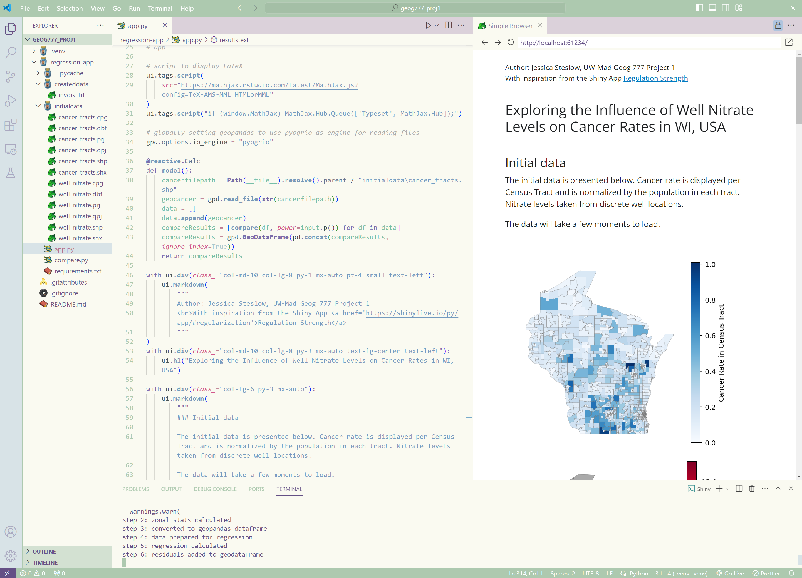
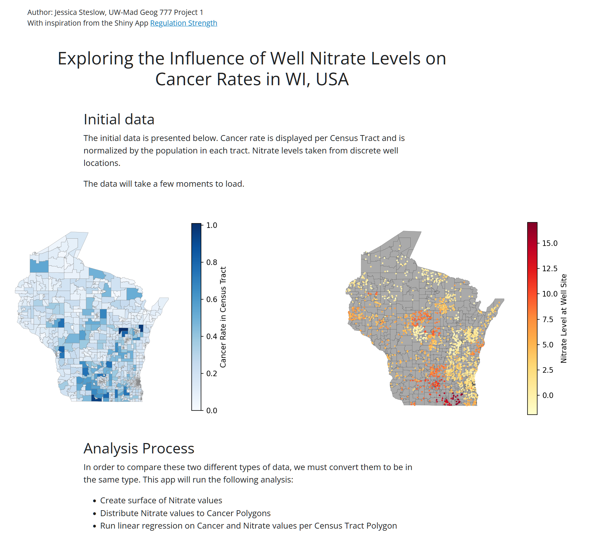
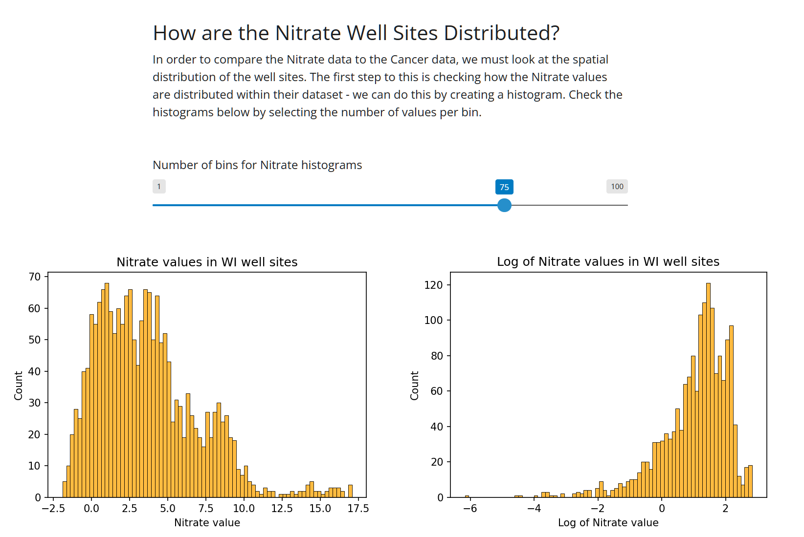
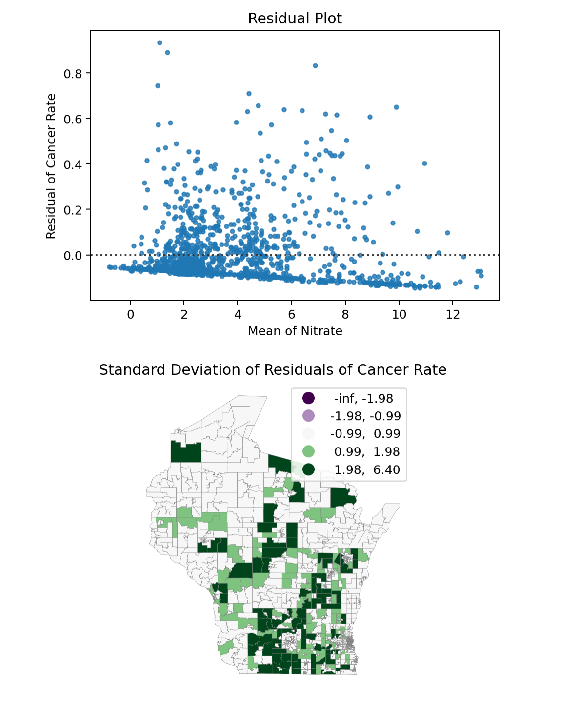
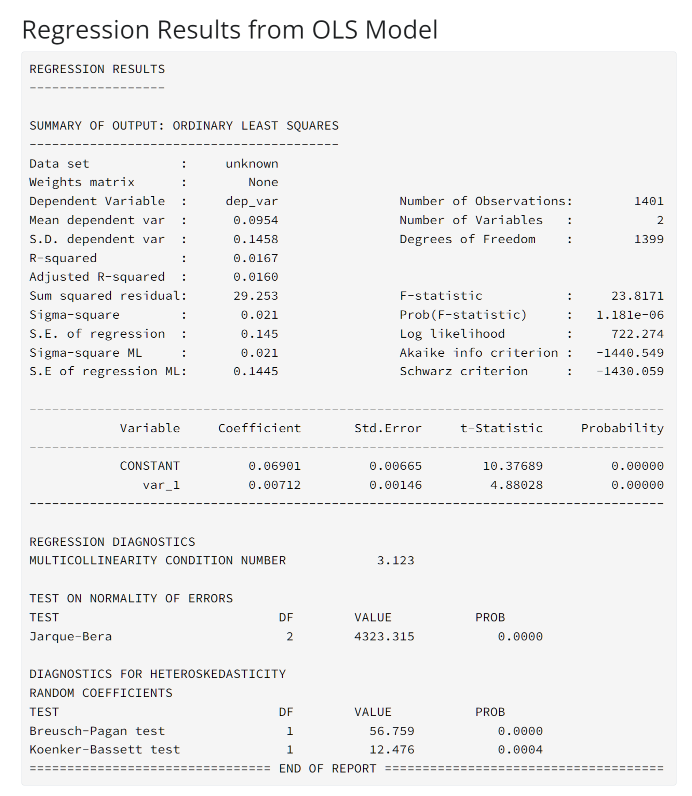

# Exploring the Influence of Well Nitrate Levels on Cancer Rates in WI, USA

This application is a scroll-based webpage with interactive widgets to view geospatial data on a map, explore statistics, calculate an Inverse Weighted Distance spatial average with a variable power parameter, and run linear regression on the data. The goal of this application is to allow the user to explore the fittness of the model on the given data.

Datasets:
- Cancer Rate per Census Tract in WI (polygons)
- Nitrate Levels in well sites in WI (points)

## Application Summary

The operations and analysis performed by this application are:
1. Display cancer rate polygonm data and nitrate levels geospatial data (shapefiles) on choropleth maps, done with geopandas and matplotlib
2. Allow the user to explore the distribution of the Nitrate data with interactive histograms, one showing the Nitrate levels and the second showing the Log of Nitrate levels. The user can vary the number of bins with a slider and both histograms react.
3. Allow the user to select a value with a slider for the Power parameter in order to run an Inverse Weighted Distance calculation on the Nitrate points. On load, the value is 1. Steps 4+ are reactive to this selection.
4. The IDW calculation is run with GDAL.grid which generates a tif image file of nitrate values per pixel, maintaining the spatial information as the source shapefile.
5. There is commented-out code to convert the tif into a png file with GDAL.translate for display, if a future user is interested in this part. But the application here does not use this code.
6. The mean value of nitrate per census tract taken from the nitrate surface is calculated with zonal statistics from the rasterstats library.
7. An Ordinary Least Squares regression is calculated on the cancer rate and mean nitrate values per census tract with the PYSAL spreg library.
8. Results of the regression are displayed with plots, a map, and a statistics-summary printout from the OLS model.

## Tech Stack

This application was built with the framework Shiny for python: https://shiny.posit.co/py/

## Requirements

The python module dependencies are stated in requirements.txt

If a user wants to build this code themselves, I want to note that this code requires GDAL to run. GDAL can be finicky to install into a python environment with pip. To install GDAL on my machine, I used pip to install a pre-built GDAL wheel from cgohlke on github: https://github.com/cgohlke/geospatial-wheels/releases

To create, test, and run this app, I used Shiny for python within Visual Studio Code with the Shiny VSCode extension. The app is able to run either within VSCode with the extension or from local-host.

## Screenshots

![Interactive IDW calculation and scatter plot results)(idw-slider-and-scatter-plot.png)

